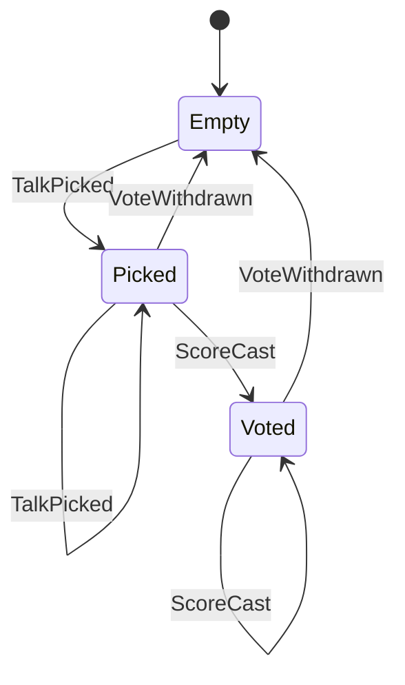

## Ideas

- [] push notif with "Voting ends in 5 min"
- [] fetch abstracts on vote component first open (or ditch abstracts whatsoever)

## Rules

1. Everyone can login.
2. There are 3 roles: Admin, Staff and Attendee.
3. Attendee can lock in one talk in a slot.
4. Attendee can vote.
5. Attendee can cancel their votes.
6. Staff inherits from attendee and can view live conference statistics.
7. Admin inherits from staff and can disable or enable votes.

## Enums

### Vote events

| kind           | description                                                      |
| -------------- | ---------------------------------------------------------------- |
| talk_picked    | Talk became the user's pick for its slot (explicit or via score) |
| score_cast     | Score set for a (presentation, category); `prev_score` if re-cast |
| vote_withdrawn | Score deleted, by the user or by switching talks in the slot     |

### Presentation category

| category | description                   |
| -------- | ----------------------------- |
| t_1      | talk substance (merytoryka)   |
| t_2      | talk form (forma)             |
| p_1      | poster substance (merytoryka) |
| p_2      | poster aesthetics (estetyka)  |

## State

Talk, per member × slot:



## Data model

### users

| column      | type                                   |
| ----------- | -------------------------------------- |
| id          | integer PK                             |
| access_code | blob (hashed)                          |
| role        | `'attendee'` \| `'staff'` \| `'admin'` |

### slots

| column          | type                   |
| --------------- | ---------------------- |
| id              | integer PK             |
| timestamp_start | integer (timestamp_ms) |
| timestamp_end   | integer (timestamp_ms) |

### presentations

| column   | type                              |
| -------- | --------------------------------- |
| id       | integer PK                        |
| type     | `'talk'` \| `'poster'`            |
| slot_id  | integer \| null (FK `slots.id`)   |
| track    | `'applied'` \| `'theory'` \| null |
| title    | text                              |
| author   | text                              |
| abstract | text \| null                      |

`picks` and `votes` are the current state (source of truth). `vote_events` is an
append-only log written in the same transaction, used only for analysis.

### picks

which talk the user attends in a slot; one row per (user, slot)

| column          | type                            |
| --------------- | ------------------------------- |
| user_id         | integer (FK `users.id`), PK     |
| slot_id         | integer (FK `slots.id`), PK     |
| presentation_id | integer (FK `presentations.id`) |

### votes

current score per (user, presentation, category); withdrawing deletes the row.
Scoring a talk implies picking it; picking another talk in the slot deletes
the scores of the previous one.

| column          | type                                     |
| --------------- | ---------------------------------------- |
| user_id         | integer (FK `users.id`), PK              |
| presentation_id | integer (FK `presentations.id`), PK      |
| category        | `'t_1'` \| `'t_2'` \| `'p_1'` \| `'p_2'`, PK |
| score           | integer 0–5                              |
| updated_at      | integer (timestamp_ms)                   |

### vote_events

| column          | type                                        |
| --------------- | ------------------------------------------- |
| id              | integer PK                                  |
| user_id         | integer (FK `users.id`)                     |
| kind            | vote_event enum                             |
| presentation_id | integer (FK `presentations.id`)             |
| slot_id         | integer \| null (FK `slots.id`)             |
| category        | category \| null (null for `talk_picked`)   |
| score           | integer \| null (new score, `score_cast`)   |
| prev_score      | integer \| null (`score_cast`, `vote_withdrawn`) |
| at              | integer (timestamp_ms)                      |

indexes: `(at)`, `(presentation_id, at)`

### app_settings

| column         | type                           |
| -------------- | ------------------------------ |
| voting_ends_at | integer (timestamp_ms) \| null |

### app_events

| column    | type                             |
| --------- | -------------------------------- |
| id        | integer PK                       |
| user_id   | integer \| null (FK `users.id`)  |
| event     | `'foreground'` \| `'background'` |
| timestamp | integer (timestamp_ms)           |

### sessions

| column    | type                                   |
| --------- | -------------------------------------- |
| id        | text PK                                |
| user_id   | integer (FK `users.id`)                |
| role      | `'attendee'` \| `'staff'` \| `'admin'` |
| expiresAt | integer (timestamp_ms)                 |

## API Endpoints

**BASE PATH:** /api

### general overview

| endpoint               | method | description                                                       | access                  |
| ---------------------- | ------ | ----------------------------------------------------------------- | ----------------------- |
| /login                 | POST   | login action, user passes code from the badge, session is created | any                     |
| /logout                | POST   | logout action, user session is deleted                            | admin, staff, attendees |
| /vote/{presentationId} | GET    | get vote for given presentation                                   | admin, staff, attendees |
| /vote/{presentationId} | POST   | post new vote for given presentation                              | admin, staff, attendees |
| /votes                 | GET    | get most recent votes for all presentations                       | admin, staff, attendees |
| /votes/disable         | POST   | starts countdown on server to disable votes                       | admin                   |
| /votes/enable          | POST   | cancles/enables voting immedietly                                 | admin                   |
| /stats                 | SSE    | recive stats about votes                                          | staff, admin            |

## Modules

### Backend modules

- Authentication
- Votes
- Settings
- Stats

```

```
